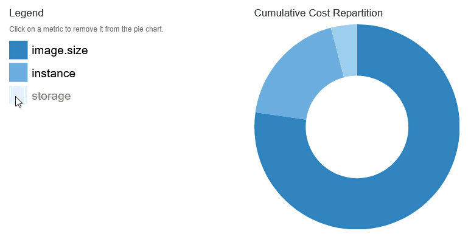
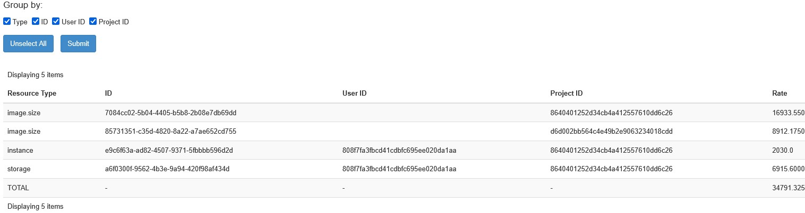
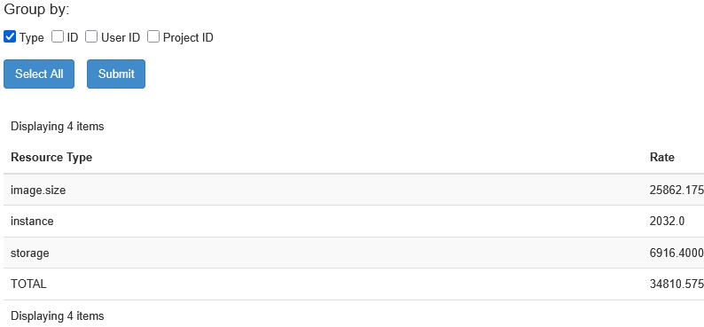

Fresh Purrspectives - Improving the CloudKitty User Experience
##################################

:date: 2025-08-22 11:30
:modified: 2025-09-04 11:30
:tags: cloudkitty, openstack, dashboard
:category: Deployment
:slug: cloudkitty-dashboard-improvements
:authors: Leonie Chamberlin-Medd
:summary: Discussing improvements to the CloudKitty dashboard for an
        enhanced user experience.

.. figure:: {static}/images/cloudkitty-mascot.png
   :width: 350px
   :alt: CloudKitty mascot

Task brief
----------

The CloudKitty Dashboard provides a GUI to explore the results of the
Rating-as-a-Service project, CloudKitty. The reporting dashboard prior to my
changes included a static pie chart and graph demonstrating the different costs
of the metrics in the current project, for the period of the current month, and
the rating dashboard showed the ratings split by metric type only.

Overall, the additions to the Dashboard provide a much more in-depth
user experience, with simpler ways to adjust the time period of the data or 
group certain results by provided attributes. 

Development Process
-------------------

Isolated in a VM, I used DevStack to quickly set up an OpenStack environment to
develop and test my additions to the CloudKitty Dashboard. CloudKitty is
deployed by default with Ceilometer as the data collection service, and Gnocchi
for metric and resource aggregation. Data used by CloudKitty is stored in the
time-series database InfluxDB.

In order to see variation in the data displayed on the graph, I found it best to
populate the database with randomised data that I generated myself. CloudKitty
uses an older version of InfluxDB, 1.6.3 to be precise, which meant a lot of the
'easier' ways to import data were not yet introduced. I managed to import data
by using a text file in line protocol form, an interestingly structured file, 
more details can be found in the `InfluxDB Line Protocol Reference
<https://docs.influxdata.com/influxdb/v1/write_protocols/line_protocol_reference/>`_ .
I wrote python scripts to quickly generate a file full of randomised data, with
the tag and field keys/values necessary for each metric type. These can then be
exported to InfluxDB with the following curl command:

.. code-block:: console

   $ curl -i -XPOST 'http://localhost:8086/write?db=DATABASE_NAME' --data-binary @file.txt

where file.txt is a textfile written in line protocol form.

Changes
-------
`Datepicker <https://review.opendev.org/c/openstack/cloudkitty-dashboard/+/958035>`__
^^^^^^^^^^
The datepicker is used to improve control over the data displayed in the
dashboard. The datepicker implemented is similar to one in another part of the
`Horizon Dashboard <https://docs.openstack.org/horizon/latest/>`__. It uses `Bootstrap Datepicker <https://bootstrap-datepicker.readthedocs.io/en/latest/#>`__
, which combines Bootstrap and
jQuery to provide an interactive datepicker widget in the Bootstrap style. In
addition to the start and end datepickers, I have also included preset ranges
under some neat dropdown buttons, with the ability to traverse to the
previous/next range using a set of arrows (e.g. if week is selected use the
right arrow to go to next week). I made sure to enable the Today button within
the Datepicker widget, to allow for quick selection. 

When combined with a Django form, it is easy to fetch the data in the time
period requested, by using the form fields and passing these into the CloudKitty
API calls.

.. figure:: datepicker_example_gif.gif
    :width: 80%
    :align: center 
    :alt: datepicker-gif

Interactive legends
^^^^^^^^^^^^^^^^^^^
An interactive legend has been added to both the `d3 pie chart <https://d3js.org/d3-shape/pie>`__
and the `Rickshaw graph <https://tech.shutterstock.com/rickshaw/>`__. Both allow you
to hide certain metrics, but the Rickshaw graph allows for reordering (layers) of
the data, and highlighting the metric that is currently being hovered over (on
the legend). Animations have been added to the pie chart for when metrics are
added/removed.

Hover-over labels and percentages for pie chart
^^^^^^^^^^^^^^^^^^^^^^^^^^^^^^^^^^^^^^^^^^^^^^^

In addition to the interactive legend, I thought it would be useful to display
the percentage that a metric takes up, which shows when you hover over the
segment. An extended hover displays the metric name.

    This gif demonstrates the animations and hover-over behaviour for the pie
    chart.

`Upgraded admin/rating panel to use v2 API <https://review.opendev.org/c/openstack/cloudkitty-dashboard/+/958033>`__
^^^^^^^^^^^^^^^^^^^^^^^^^^^^^^^^^^^^^^^^^^

The admin rating panel has been upgraded to use v2 of the CloudKitty API, to
match the project/rating panel. This allows for filtering and a generally more
useful API call, providing more detailed responses.

`Grouping functionality <https://review.opendev.org/c/openstack/cloudkitty-dashboard/+/958034>`__
^^^^^^^^^^^^^^^^^^^^^^
For both rating panels, which by default display the breakdown of rates by Resource Type,
the ability to group the ratings by certain attributes (which are configurable)
has been added. This is achieved by using a custom form and a set of checkboxes.
[Type] is set to be the default if no list has been provided in the configuration.

                        

